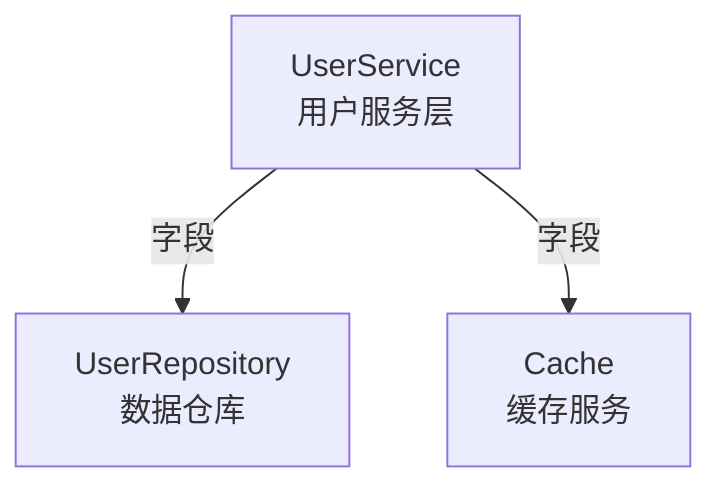

# Go Struct Analyzer

Go 项目结构体依赖关系分析工具，用于分析 Go 语言项目中结构体之间的依赖关系，并可选使用 Claude API 生成代码描述。

## 功能特性

- 递归扫描 Go 项目中的所有结构体
- 分析多种依赖关系类型：
  - 字段依赖
  - 方法内初始化依赖
  - 方法调用依赖
  - 接口实现关系
  - 结构体嵌入
- 支持深度控制的 BFS 遍历
- 自动过滤标准库和第三方依赖
- 支持黑名单配置
- 生成 Markdown 格式的分析报告
- 生成 Mermaid 依赖关系图
- 可选集成 Claude API 生成代码描述

## 安装

```bash
go install github.com/user/go-struct-analyzer/cmd/analyzer@latest
```

或者从源码构建：

```bash
git clone https://github.com/user/go-struct-analyzer.git
cd go-struct-analyzer
go build -o go-struct-analyzer ./cmd/analyzer
```

## 使用方法

### 基础使用

```bash
# 分析项目中的 UserService 结构体及其依赖
go-struct-analyzer --project ./myapp --start UserService --depth 2
```

### 启用 LLM 分析

```bash
# 使用 Claude API 生成代码描述
go-struct-analyzer -p ./myapp -s UserService -k $CLAUDE_API_KEY

# 或通过环境变量设置 API Key
export CLAUDE_API_KEY=sk-ant-xxx
go-struct-analyzer -p ./myapp -s UserService
```

### 使用黑名单

```bash
# 使用黑名单配置忽略特定类型
go-struct-analyzer -p ./myapp -s UserService -b ./blacklist.yaml
```

### 详细模式

```bash
# 输出详细的分析过程
go-struct-analyzer -p ./myapp -s UserService -v
```

### 生成 Mermaid 图

```bash
# 同时生成 Mermaid 依赖关系图
go-struct-analyzer -p ./myapp -s UserService --mermaid ./deps.mmd
```

## 命令行参数

| 参数 | 简写 | 说明 | 默认值 |
|------|------|------|--------|
| --project | -p | 项目路径（必需） | - |
| --start | -s | 起点结构体名称（必需） | - |
| --depth | -d | 分析深度 | 2 |
| --output | -o | 输出文件路径 | ./analysis_report.md |
| --format | -f | 输出格式 (markdown/json) | markdown |
| --blacklist | -b | 黑名单文件路径 | - |
| --api-key | -k | Claude API Key | - |
| --mermaid | - | Mermaid 图输出路径 | - |
| --verbose | -v | 详细输出模式 | false |

## 黑名单配置

创建 YAML 格式的黑名单文件：

```yaml
# blacklist.yaml
types:
  - Logger
  - Config
  - Mutex

packages:
  - log
  - config
```

## 输出示例

### Markdown 报告

生成的报告包含：

1. **分析概览** - 结构体数量、依赖关系统计
2. **按深度分组的结构体详情** - 每个结构体的字段、方法和依赖
3. **Mermaid 依赖关系图** - 可视化的依赖图
4. **统计信息** - 被依赖次数排行、循环依赖检测

### Mermaid 图



## 项目结构

```
go-struct-analyzer/
├── cmd/
│   └── analyzer/
│       └── main.go              # CLI 入口
├── internal/
│   ├── parser/
│   │   ├── parser.go            # AST 解析器
│   │   └── type_resolver.go     # 类型解析器
│   ├── analyzer/
│   │   ├── dependency.go        # 依赖关系分析
│   │   ├── traverser.go         # BFS 遍历器
│   │   ├── blacklist.go         # 黑名单过滤
│   │   └── scope_filter.go      # 范围过滤
│   ├── llm/
│   │   ├── client.go            # Claude API 客户端
│   │   ├── prompt.go            # Prompt 模板
│   │   └── response.go          # 响应解析
│   ├── reporter/
│   │   ├── markdown.go          # Markdown 报告
│   │   ├── mermaid.go           # Mermaid 图
│   │   └── json.go              # JSON 输出
│   └── types/
│       └── models.go            # 数据结构定义
├── testdata/
│   └── sample_project/          # 测试项目
├── blacklist.yaml               # 默认黑名单配置
├── go.mod
└── README.md
```

## 开发

### 运行测试

```bash
go test ./...
```

### 使用测试项目

```bash
go run ./cmd/analyzer \
    --project ./testdata/sample_project \
    --start UserService \
    --depth 2 \
    --output ./test_report.md \
    --mermaid ./test_deps.mmd \
    --verbose
```

## 许可证

MIT License
