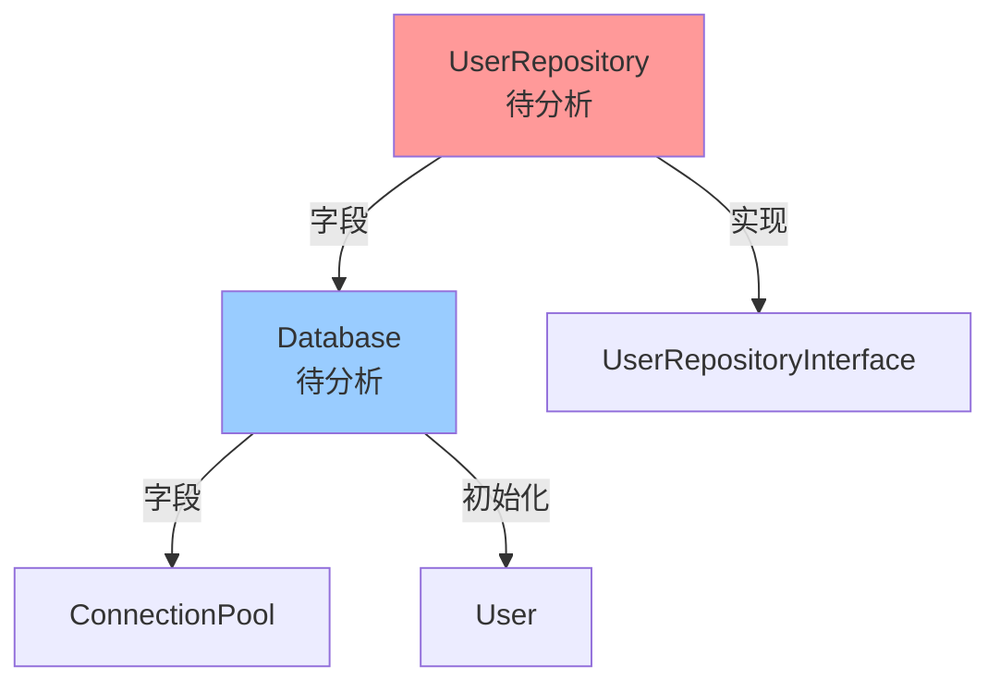

# Go 项目结构体依赖分析报告

**项目路径**: /Users/albert/Desktop/fromGithub/anal_go_agent/testdata/sample_project
**分析起点**: UserRepository
**分析深度**: 1
**生成时间**: 2026-01-20 01:18:02

---

## 分析概览

- **总结构体数**: 2
- **分析深度分布**:
  - 深度 0: 1 个
  - 深度 1: 1 个
- **总依赖关系数**: 4
- **循环依赖**: 0 个

---

## 深度 0

### UserRepository

**功能**: 待分析

**所属包**: `repository`

#### 字段列表

| 字段名 | 类型 | 导出 | 描述 |
|--------|------|------|------|
| db | \*Database | ✗ | 待分析 |

#### 方法列表

| 方法名 | 签名 | 导出 | 描述 |
|--------|------|------|------|
| Save | (user model.User) error | ✓ | 待分析 |
| FindByID | (id int64) (\*model.User, error) | ✓ | 待分析 |
| Update | (user \*model.User) error | ✓ | 待分析 |
| Delete | (id int64) error | ✓ | 待分析 |
| FindAll | () ([]\*model.User, error) | ✓ | 待分析 |

#### 依赖关系

| 目标结构体 | 依赖类型 | 上下文 | 深度 |
|-----------|---------|--------|------|
| Database | 字段依赖 | db 字段 | 1 |
| UserRepositoryInterface | 接口实现 | 实现接口 | 1 |

---

## 深度 1

### Database

**功能**: 待分析

**所属包**: `repository`

#### 字段列表

| 字段名 | 类型 | 导出 | 描述 |
|--------|------|------|------|
| connectionString | string | ✗ | 待分析 |
| pool | \*ConnectionPool | ✗ | 待分析 |

#### 方法列表

| 方法名 | 签名 | 导出 | 描述 |
|--------|------|------|------|
| Insert | (table string, data interface{}) error | ✓ | 待分析 |
| QueryByID | (table string, id int64) (interface{}, error) | ✓ | 待分析 |
| QueryAll | (table string) ([]interface{}, error) | ✓ | 待分析 |
| Update | (table string, id int64, data interface{}) error | ✓ | 待分析 |
| DeleteByID | (table string, id int64) error | ✓ | 待分析 |

#### 依赖关系

| 目标结构体 | 依赖类型 | 上下文 | 深度 |
|-----------|---------|--------|------|
| ConnectionPool | 字段依赖 | pool 字段 | 2 |
| User | 方法内初始化 | QueryByID 方法 | 2 |

---

## 依赖关系图

---

## 统计信息

### 依赖深度分布
- 深度 0: 1 个结构体
- 深度 1: 1 个结构体

### 被依赖次数排行
1. User - 被依赖 1 次
2. Database - 被依赖 1 次
3. UserRepositoryInterface - 被依赖 1 次
4. ConnectionPool - 被依赖 1 次

---

生成于: 2026-01-20 01:18:02
