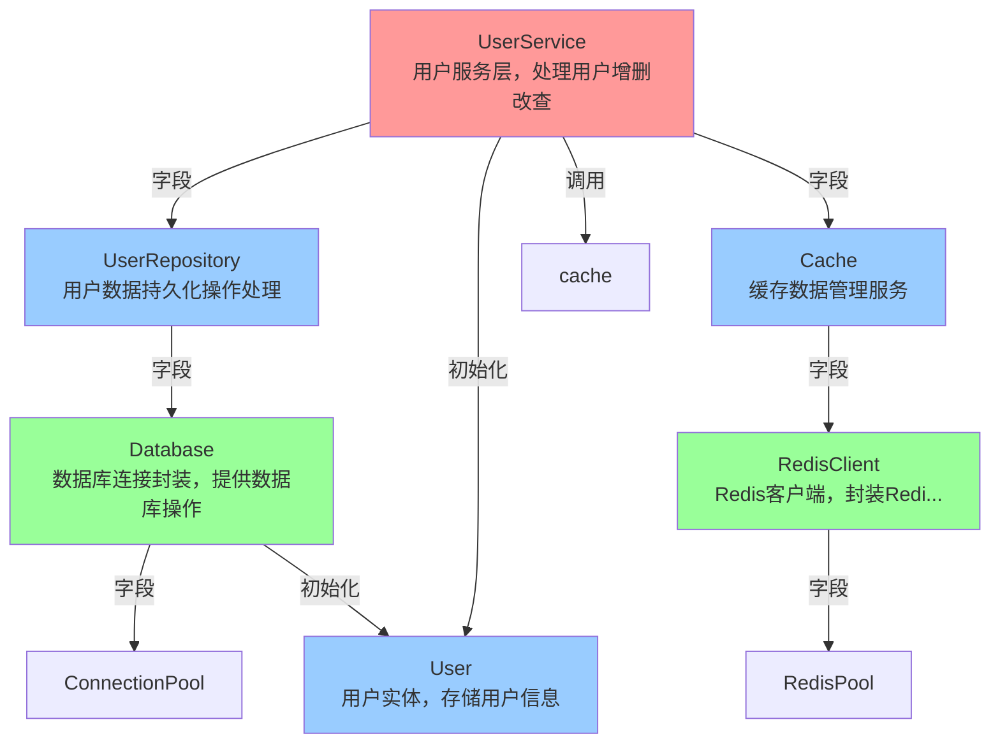

# Go 项目结构体依赖分析报告

**项目路径**: E:\claude_project\anal_go_agent\go-struct-analyzer\testdata\sample_project
**分析起点**: UserService
**分析深度**: 2
**生成时间**: 2026-01-19 16:30:22

---

## 分析概览

- **总结构体数**: 6
- **分析深度分布**:
  - 深度 0: 1 个
  - 深度 1: 3 个
  - 深度 2: 2 个
- **总依赖关系数**: 10
- **循环依赖**: 0 个

---

## 深度 0

### UserService

**功能**: 用户服务层，处理用户增删改查

**所属包**: `service`

#### 字段列表

| 字段名 | 类型 | 导出 | 描述 |
|--------|------|------|------|
| repo | \*repository.UserRepository | ✗ | 用户数据持久化仓库 |
| cache | \*cache.Cache | ✗ | 用户信息缓存 |

#### 方法列表

| 方法名 | 签名 | 导出 | 描述 |
|--------|------|------|------|
| CreateUser | (name string, age int) error | ✓ | 创建用户 |
| GetUserByID | (id int64) (\*model.User, error) | ✓ | 获取用户 |
| UpdateUser | (user \*model.User) error | ✓ | 更新用户信息 |
| DeleteUser | (id int64) error | ✓ | 删除用户 |

#### 依赖关系

| 目标结构体 | 依赖类型 | 上下文 | 深度 |
|-----------|---------|--------|------|
| UserRepository | 字段依赖 | repo 字段 | 1 |
| Cache | 字段依赖 | cache 字段 | 1 |
| User | 方法内初始化 | CreateUser 方法 | 1 |
| User | 方法调用 | CreateUser -> Validate | 1 |
| cache | 方法调用 | GetUserByID -> Get | 1 |

---

## 深度 1

### UserRepository

**功能**: 用户数据持久化操作处理

**所属包**: `repository`

#### 字段列表

| 字段名 | 类型 | 导出 | 描述 |
|--------|------|------|------|
| db | \*Database | ✗ | 数据库连接 |

#### 方法列表

| 方法名 | 签名 | 导出 | 描述 |
|--------|------|------|------|
| Save | (user model.User) error | ✓ | 保存用户 |
| FindByID | (id int64) (\*model.User, error) | ✓ | 查找用户 |
| Update | (user \*model.User) error | ✓ | 更新用户信息 |
| Delete | (id int64) error | ✓ | 删除用户 |
| FindAll | () ([]\*model.User, error) | ✓ | 查找所有用户 |

#### 依赖关系

| 目标结构体 | 依赖类型 | 上下文 | 深度 |
|-----------|---------|--------|------|
| Database | 字段依赖 | db 字段 | 2 |

---

### Cache

**功能**: 缓存数据管理服务

**所属包**: `cache`

#### 字段列表

| 字段名 | 类型 | 导出 | 描述 |
|--------|------|------|------|
| client | \*RedisClient | ✗ | Redis客户端 |
| ttl | time.Duration | ✗ | 缓存过期时间 |
| mu | sync.RWMutex | ✗ | 读写锁 |
| local | map[int64]interface{} | ✗ | 本地缓存 |

#### 方法列表

| 方法名 | 签名 | 导出 | 描述 |
|--------|------|------|------|
| Get | (key int64) interface{} | ✓ | 获取缓存数据 |
| Set | (key int64, value interface{}) | ✓ | 设置缓存数据 |
| Delete | (key int64) | ✓ | 删除缓存数据 |
| Clear | () | ✓ | 清空缓存 |

#### 依赖关系

| 目标结构体 | 依赖类型 | 上下文 | 深度 |
|-----------|---------|--------|------|
| RedisClient | 字段依赖 | client 字段 | 2 |

---

### User

**功能**: 用户实体，存储用户信息

**所属包**: `model`

#### 字段列表

| 字段名 | 类型 | 导出 | 描述 |
|--------|------|------|------|
| ID | int64 | ✓ | 用户唯一标识 |
| Name | string | ✓ | 用户姓名 |
| Age | int | ✓ | 用户年龄 |
| Email | string | ✓ | 用户邮箱 |
| CreatedAt | time.Time | ✓ | 创建时间 |
| UpdatedAt | time.Time | ✓ | 更新时间 |

#### 方法列表

| 方法名 | 签名 | 导出 | 描述 |
|--------|------|------|------|
| Validate | () error | ✓ | 验证用户数据 |
| IsAdult | () bool | ✓ | 判断是否成年 |
| UpdateTimestamp | () | ✓ | 更新时间戳 |

---

## 深度 2

### Database

**功能**: 数据库连接封装，提供数据库操作

**所属包**: `repository`

#### 字段列表

| 字段名 | 类型 | 导出 | 描述 |
|--------|------|------|------|
| connectionString | string | ✗ | 数据库连接字符串 |
| pool | \*ConnectionPool | ✗ | 数据库连接池 |

#### 方法列表

| 方法名 | 签名 | 导出 | 描述 |
|--------|------|------|------|
| Insert | (table string, data interface{}) error | ✓ | 插入数据 |
| QueryByID | (table string, id int64) (interface{}, error) | ✓ | 根据ID查询 |
| QueryAll | (table string) ([]interface{}, error) | ✓ | 查询所有数据 |
| Update | (table string, id int64, data interface{}) error | ✓ | 更新数据 |
| DeleteByID | (table string, id int64) error | ✓ | 根据ID删除 |

#### 依赖关系

| 目标结构体 | 依赖类型 | 上下文 | 深度 |
|-----------|---------|--------|------|
| ConnectionPool | 字段依赖 | pool 字段 | 3 |
| User | 方法内初始化 | QueryByID 方法 | 3 |

---

### RedisClient

**功能**: Redis客户端，封装Redis操作

**所属包**: `cache`

#### 字段列表

| 字段名 | 类型 | 导出 | 描述 |
|--------|------|------|------|
| address | string | ✗ | Redis服务器地址 |
| password | string | ✗ | Redis服务器密码 |
| db | int | ✗ | 使用的数据库索引 |
| pool | \*RedisPool | ✗ | 连接池管理 |

#### 方法列表

| 方法名 | 签名 | 导出 | 描述 |
|--------|------|------|------|
| Get | (key int64) interface{} | ✓ | 获取Redis数据 |
| Set | (key int64, value interface{}, ttl time.Duration) | ✓ | 设置Redis数据 |
| Delete | (key int64) | ✓ | 删除Redis数据 |
| FlushAll | () | ✓ | 清空Redis所有数据 |

#### 依赖关系

| 目标结构体 | 依赖类型 | 上下文 | 深度 |
|-----------|---------|--------|------|
| RedisPool | 字段依赖 | pool 字段 | 3 |

---

## 依赖关系图

---

## 统计信息

### 依赖深度分布
- 深度 0: 1 个结构体
- 深度 1: 3 个结构体
- 深度 2: 2 个结构体

### 被依赖次数排行
1. User - 被依赖 3 次
2. cache - 被依赖 1 次
3. Database - 被依赖 1 次
4. RedisClient - 被依赖 1 次
5. ConnectionPool - 被依赖 1 次
6. RedisPool - 被依赖 1 次
7. UserRepository - 被依赖 1 次
8. Cache - 被依赖 1 次

---

生成于: 2026-01-19 16:30:22
