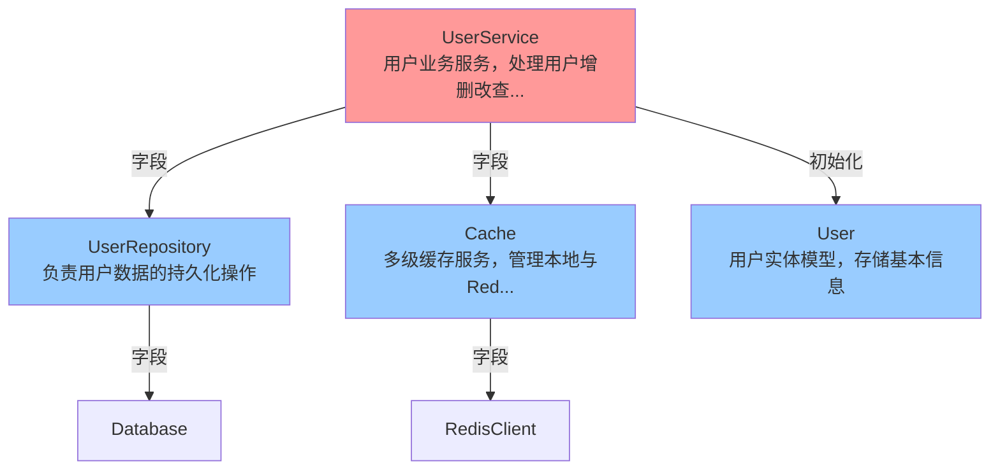

# Go 项目结构体依赖分析报告

**项目路径**: /Users/albert/Desktop/fromGithub/anal_go_agent/testdata/sample_project
**分析起点**: UserService
**分析深度**: 1
**生成时间**: 2026-01-19 21:42:38

---

## 分析概览

- **总结构体数**: 4
- **分析深度分布**:
  - 深度 0: 1 个
  - 深度 1: 3 个
- **总依赖关系数**: 6
- **循环依赖**: 0 个

---

## 深度 0

### UserService

**功能**: 用户业务服务，处理用户增删改查及缓存

**所属包**: `service`

#### 字段列表

| 字段名 | 类型 | 导出 | 描述 |
|--------|------|------|------|
| repo | \*repository.UserRepository | ✗ | 用户数据持久化 |
| cache | \*cache.Cache | ✗ | 用户数据缓存 |

#### 方法列表

| 方法名 | 签名 | 导出 | 描述 |
|--------|------|------|------|
| CreateUser | (name string, age int) error | ✓ | 创建新用户 |
| GetUserByID | (id int64) (\*model.User, error) | ✓ | 根据ID查询用户 |
| UpdateUser | (user \*model.User) error | ✓ | 更新用户信息 |
| DeleteUser | (id int64) error | ✓ | 删除指定用户 |

#### 依赖关系

| 目标结构体 | 依赖类型 | 上下文 | 深度 |
|-----------|---------|--------|------|
| UserRepository | 字段依赖 | repo 字段 | 1 |
| Cache | 字段依赖 | cache 字段 | 1 |
| User | 方法内初始化 | CreateUser 方法 | 1 |
| User | 方法调用 | CreateUser -> Validate | 1 |

---

## 深度 1

### UserRepository

**功能**: 负责用户数据的持久化操作

**所属包**: `repository`

#### 字段列表

| 字段名 | 类型 | 导出 | 描述 |
|--------|------|------|------|
| db | \*Database | ✗ | 数据库操作对象 |

#### 方法列表

| 方法名 | 签名 | 导出 | 描述 |
|--------|------|------|------|
| Save | (user model.User) error | ✓ | 保存用户到数据库 |
| FindByID | (id int64) (\*model.User, error) | ✓ | 根据ID查找用户 |
| Update | (user \*model.User) error | ✓ | 更新用户信息 |
| Delete | (id int64) error | ✓ | 删除指定用户 |
| FindAll | () ([]\*model.User, error) | ✓ | 查找所有用户 |

#### 依赖关系

| 目标结构体 | 依赖类型 | 上下文 | 深度 |
|-----------|---------|--------|------|
| Database | 字段依赖 | db 字段 | 2 |

---

### Cache

**功能**: 多级缓存服务，管理本地与Redis数据

**所属包**: `cache`

#### 字段列表

| 字段名 | 类型 | 导出 | 描述 |
|--------|------|------|------|
| client | \*RedisClient | ✗ | Redis客户端连接 |
| ttl | time.Duration | ✗ | 数据过期时长 |
| mu | sync.RWMutex | ✗ | 并发读写锁 |
| local | map[int64]interface{} | ✗ | 本地内存缓存 |

#### 方法列表

| 方法名 | 签名 | 导出 | 描述 |
|--------|------|------|------|
| Get | (key int64) interface{} | ✓ | 获取指定键的值 |
| Set | (key int64, value interface{}) | ✓ | 设置键值对 |
| Delete | (key int64) | ✓ | 删除指定键缓存 |
| Clear | () | ✓ | 清空所有缓存数据 |

#### 依赖关系

| 目标结构体 | 依赖类型 | 上下文 | 深度 |
|-----------|---------|--------|------|
| RedisClient | 字段依赖 | client 字段 | 2 |

---

### User

**功能**: 用户实体模型，存储基本信息

**所属包**: `model`

#### 字段列表

| 字段名 | 类型 | 导出 | 描述 |
|--------|------|------|------|
| ID | int64 | ✓ | 用户唯一标识 |
| Name | string | ✓ | 用户姓名 |
| Age | int | ✓ | 用户年龄 |
| Email | string | ✓ | 用户邮箱 |
| CreatedAt | time.Time | ✓ | 创建时间 |
| UpdatedAt | time.Time | ✓ | 更新时间 |

#### 方法列表

| 方法名 | 签名 | 导出 | 描述 |
|--------|------|------|------|
| Validate | () error | ✓ | 验证用户数据 |
| IsAdult | () bool | ✓ | 判断是否成年 |
| UpdateTimestamp | () | ✓ | 更新修改时间 |

---

## 依赖关系图

---

## 统计信息

### 依赖深度分布
- 深度 0: 1 个结构体
- 深度 1: 3 个结构体

### 被依赖次数排行
1. User - 被依赖 2 次
2. UserRepository - 被依赖 1 次
3. Cache - 被依赖 1 次
4. Database - 被依赖 1 次
5. RedisClient - 被依赖 1 次

---

生成于: 2026-01-19 21:42:38
